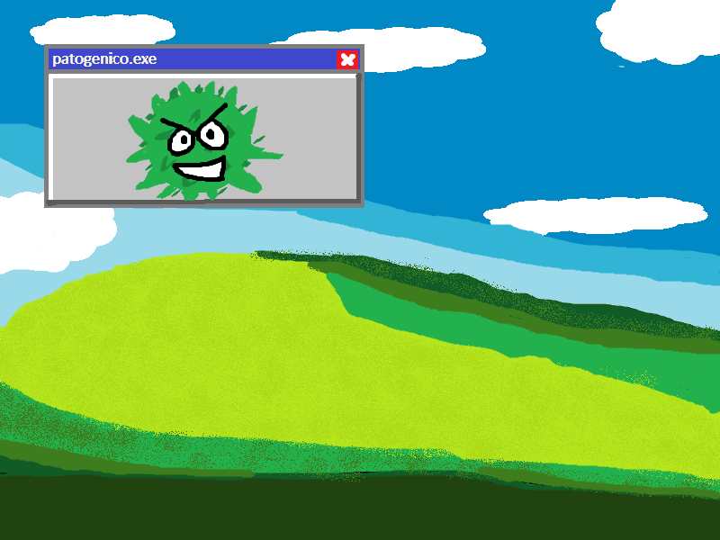

# Patogênico.exe

## Tabela de conteúdos
- [Sobre](#sobre)
- [A biologia por trás](#biologia)
- [Algoritmos e programação](#algoritmos)
- [Links externos](#links)
- [Última Atualização](#atualizacoes)

## Sobre 

Patogênico é um jogo desenvolvido para a faculdade como projeto integrador do 2° semestre. A proposta é desenvolver um jogo usando a biblioteca Allegro 5, na linguagem de programação C, que seja educativo para alunos do ensino médio.  
Nosso jogo é sobre o mosquito *Aedes aegypti* e o vírus da dengue, que o jogador controla para  infectar o ser-humano, compreendendo os processos que passa para nos infectar e deixar doentes.

## A biologia por trás 

O jogador controla, na primeira etapa do jogo, um mosquito infectado com dengue, que pica um ser-humano. Após isso, controla o vírus absorvendo nutrientes e se clonando para se propagar pelo resto do corpo. A última etapa é quando o vírus já está em grande número e pode se propagar pela nossa corrente sanguínea. Cada etapa será bem definida a seguir:

* ### A picada

Um mosquito fêmea da espécie *Aedes aegypti* é o **vetor** da dengue; isto quer dizer que não pegamos a doença direto do mosquito, mas sim *através* dele. O processo é o seguinte: o mosquito pica alguém que está infectado, e então se torna infectivo. Após dias, ele pica outra pessoa, saudável, e agora sim o vírus é transmitido diretamente para o sangue da pessoa.

* ### Fagocitose

Agora no nosso corpo, o vírus penetra uma célula e muda seu "código", fazendo com que ela consuma nutrientes e comece a clonar o vírus ela mesma. Este processo acaba destruindo a célula no fim. Após ser clonado, cada vírus sai da célula que estava e penetra outra célula, crescendo seu número exponencialmente.  
    Porém, o sistema imune do nosso corpo tenta destruir essas células infectadas através de um processo chamado **fagocitose**.

    
Como possível ver na imagem acima, a célula saudável cobre a partícula indesejada (no nosso caso a célula infectada com a dengue), a digere por dentro e por fim despeja seus destroços. Nesta etapa do jogo, o objetivo é o vírus conseguir ser clonado enquanto evita ser destruido pelos fagócitos (células capazes de fazer fagocitose).

* ### Viremia

Caso consiga sobreviver, após se reproduzir os vírus no corpo se espalham pela nossa corrente sanguínea, podendo então atingir basicamente qualquer órgão. Esta presença do vírus no sangue é o que chamamos de **viremia**. Na dengue, especificamente, categorizamos como viremia passiva pois o vírus é depositado diretamente no nosso sangue (por conta da picada do mosquito).

## Algoritmos e programação 

O jogo terá 3 mini-jogos, um para cada etapa de infecção. A programação de cada um fica separada entre vários `switch: case`. A seguir, a explicação de qual a proposta de cada mini-jogo e seus algoritmos.

* ### Mosquito

Como jogo inicial, este deve ser o mais fácil. O jogador utiliza o teclado para mover o mosquito para cima e para baixo, evitando ser morto por aranhas e uma mão humana.

* ### Fagocitose

Na segunda fase, o jogador controla uma célula infectada e deve consumir nutrientes (pequenas bolinhas espalhadas pela tela) enquanto desvia de fagócitos tentando eliminá-lo. Esta mecânica é inspirada no jogo multiplayer online Agar.io, como na imagem abaixo.

Como haveriam muitas bolinhas na tela, um sistema de colisão mais eficiente teve de ser implementado. Veja que na imagem acima há uma grade no fundo; no mini-jogo sobre fagocitose, a colisão é checada apenas nos 9 quadrados ao redor do jogador, diminuindo sua complexidade de O(n) para O(k).

* ### Viremia

Aqui o jogador controla o vírus no processo de infecção completa do ser-humano: linhas são geradas aleatoriamente na tela, e o objetivo é evitar que o mouse saia de dentro dessas linhas. Toda vez que se chega do outro lado da tela, no "destino", um novo padrão de linhas é gerado, e o destino agora é outro. Cada vez que se atinge o destino, a espessura das linhas diminui, aumentando a dificuldade.

## Links externos 
- Roteiro de falas: [google docs](https://docs.google.com/document/d/16gaW1oDv8f9qrr2GSL31v_34xzxDkxPBFBPKD5Qkxgo/edit?usp=sharing)
- Moodboard: [canva](https://www.canva.com/design/DAGRo9KRR6Q/Fd1EgLr0FTRXVkg5y6Y6Zg/edit?utm_content=DAGRo9KRR6Q&utm_campaign=designshare&utm_medium=link2&utm_source=sharebutton)

## Última atualização 
Este documento foi atualizado pela última vez no dia 24/10.
